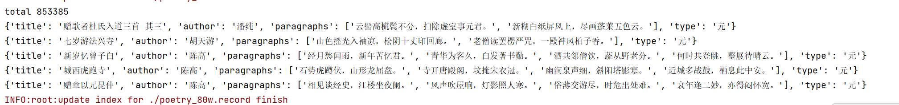

## 诗堂数据介绍 共计 853385 , 按照朝代
    {'元': 37375, '元末明初': 15736, '先秦': 570, '南北朝': 4586, '唐': 49195, '唐末宋初': 1118, '宋': 287114, '宋末元初': 12058, '宋末金初': 234, '当代': 28213, '集于沽上，访梦碧词社旧址，兼祭梦翁，秋扇并缋斜街寻梦图，拈此调同赋': 1, '并赠琼瑶': 1, '追念旧游': 1, '书此相赠': 1, '去岁八月经此忽忽一载矣': 1, '其女云，我父终于自由了。闻之喟然': 1, '明': 236956, ' 西征愧赋才。 月明笳鼓切': 1, '明末清初': 17700, '民国末当代初': 1948, '汉': 363, '清': 90081, '访之': 1, '用原韵奉酬': 1, '柬快庵': 1, '留别缄斋': 1, '芝麓宗伯追送': 1, '用刘后村自寿韵二首 其一': 1, '用刘后村自寿韵二首 其二': 1, '用刘后村自寿韵二首': 1, '清末民国初': 15367, '清末近现代初': 12464, '秦': 2, '辽': 22, '近现代': 28416, '享年八十五': 1, '戴上“右派分子”帽，已逾三年半，今夜始宣布摘帽': 1, '诗以纪实': 1, '近现代末当代初': 3426, '金': 2741, '金末元初': 3019, '隋': 1170, '隋末唐初': 472, '魏晋': 3020, '魏晋末南北朝初': 1}

    数据切分成两部分：
            唐宋及其以前 poetry_80w_part1.record  359903
            元明清及以后 poetry_80w_part2.record  493482


#### 参考数据集 https://github.com/Werneror/Poetry

## 使用demo
pip install -U fastdatasets
```python
import json
from fastdatasets.record import load_dataset, RECORD
record_file = ['./poetry_80w_part1.record ','./poetry_80w_part2.record ']
dataset = load_dataset.RandomDataset(record_file,options = RECORD.TFRecordOptions(compression_type='GZIP')).parse_from_numpy_writer()

def poetry_parser(x):
    x = str(x['node'].tolist(), encoding='utf-8')
    x = json.loads(x)
    return x
dataset = dataset.map(poetry_parser)

print('total',len(dataset))
for i in range(len(dataset)):
    d = dataset[i]
    print(d)
    if i > 3:
        break
```

