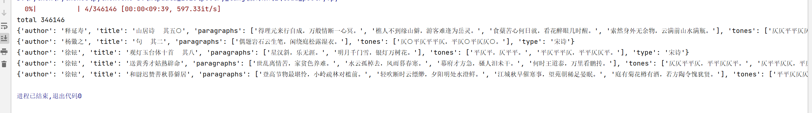

## 诗堂数据介绍 共计 346146 , 其中唐诗 , 宋诗 带平仄关系
    唐诗+宋诗 311855
    宋词 21333
    楚辞 65
    曹操诗 26
    论语 20
    孟学 850
    诗经 305
    四书五经 16
    花间集 498
    南唐词 45
    幽梦影 219
    元曲 10914
    
#### 参考数据集 https://github.com/chinese-poetry/chinese-poetry

## 使用demo
pip install -U fastdatasets
```python
import json
from fastdatasets.record import load_dataset, RECORD
from tqdm import tqdm
record_file = './poetry_tangsong.record'
dataset = load_dataset.RandomDataset(record_file,options = RECORD.TFRecordOptions(compression_type='GZIP')).parse_from_numpy_writer()

def poetry_parser(x):
    x = str(x['node'].tolist(), encoding='utf-8')
    x = json.loads(x)
    return x
dataset = dataset.map(poetry_parser)

print('total',len(dataset))

vocab = {}
for i in tqdm(range(len(dataset)),total=len(dataset)):
    d = dataset[i]
    print(d)
    if i > 3:
        break
```

