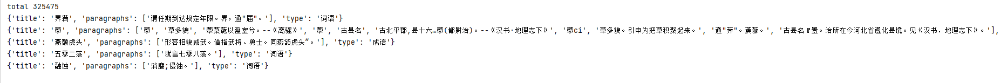

## 成语 共计 325475
   {'词语': 264406, '成语': 30895, '汉字': 16142, '歇后语': 14032}
#### 参考数据集 https://github.com/chinese-poetry/chinese-poetry

## 使用demo
pip install -U fastdatasets
```python
import json
from fastdatasets.record import load_dataset, RECORD
record_file = './tangsong.record'
dataset = load_dataset.RandomDataset(record_file,options = RECORD.TFRecordOptions(compression_type='GZIP')).parse_from_numpy_writer()

def poetry_parser(x):
    x = str(x['node'].tolist(), encoding='utf-8')
    x = json.loads(x)
    return x
dataset = dataset.map(poetry_parser)

print('total',len(dataset))
for i in range(len(dataset)):
    d = dataset[i]
    print(d)
    if i > 3:
        break
```

