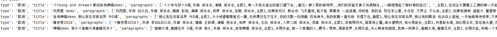

<<<<<<< HEAD:歌词/README.md
# 歌词 102198

## 使用demo
pip install -U fastdatasets
```python
import json
from fastdatasets.record import load_dataset, RECORD
record_file = './歌词.record'
=======
# -*- coding: utf-8 -*-
# @Time    : 2023/1/22 20:58
# @Author  : tk
# @FileName: load_poetry.py
import json
from fastdatasets.record import load_dataset, RECORD
from tqdm import tqdm
from zhconv import convert

def is_chinese_char(cp):
  if ((cp >= 0x4E00 and cp <= 0x9FFF) or  #
          (cp >= 0x3400 and cp <= 0x4DBF) or  #
          (cp >= 0x20000 and cp <= 0x2A6DF) or  #
          (cp >= 0x2A700 and cp <= 0x2B73F) or  #
          (cp >= 0x2B740 and cp <= 0x2B81F) or  #
          (cp >= 0x2B820 and cp <= 0x2CEAF) or
          (cp >= 0xF900 and cp <= 0xFAFF) or  #
          (cp >= 0x2F800 and cp <= 0x2FA1F)):  #
    return True
  return False

record_file = './poetry_corpus.record'
>>>>>>> 71f22b5bbb9dbe42d7b8dcb9e560b3373124a691:load_poetry.py
dataset = load_dataset.RandomDataset(record_file,options = RECORD.TFRecordOptions(compression_type='GZIP')).parse_from_numpy_writer()

def poetry_parser(x):
    x = str(x['node'].tolist(), encoding='utf-8')
    x = json.loads(x)
    return x
dataset = dataset.map(poetry_parser)

print('total',len(dataset))

vocab = {}
for i in tqdm(range(len(dataset)),total=len(dataset)):
    d = dataset[i]
<<<<<<< HEAD:歌词/README.md
    print(d)
    if i > 3:
        break
```


=======
    if i < 3:
        print(d)
    string = d.get('title','') + ''.join(d['paragraphs'])
    string = convert(string, 'zh-cn')
    for char in string:
        if not is_chinese_char(ord(char)):
            continue
        if char not in vocab:
            vocab[char] = 0
        vocab[char] += 1
vocab = dict(sorted(vocab.items(),key=lambda x: x[1],reverse=True))


vocab = {k:v for k,v in vocab.items() if v > 10}
print(vocab)
print(len(vocab))
>>>>>>> 71f22b5bbb9dbe42d7b8dcb9e560b3373124a691:load_poetry.py
